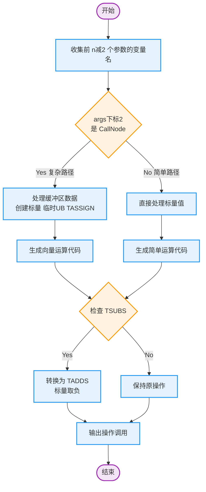

# `BinaryVecOpsCodegen` 函数分析文档

## 一、核心业务流程

本函数是 `CodeGenTileLangAscendPto` 类的成员函数，用于为华为昇腾AI处理器生成**二元向量操作**的Ascend C代码（如向量加法、减法等运算）。

### 主流程概述

```
输入处理 → 参数变量名收集 → 分支判断 → 代码生成 → 输出
```

### 详细流程步骤

| 步骤 | 描述 |
|------|------|
| **1. 参数预处理** | 遍历 `op->args` 的前 `n-2` 个参数，调用 `PrintBufferOffset()` 获取变量名并存储到 `var_names` 向量中 |
| **2. 分支判断** | 检查 `op->args[2]` 是否为 `CallNode` 类型，决定走复杂分支还是简单分支 |
| **3a. 复杂分支** | 处理缓冲区数据：创建临时标量、获取UB信息、创建临时TileUbDataND对象、执行TASSIGN、生成向量运算代码 |
| **3b. 简单分支** | 直接处理标量值：特殊处理TSUBS操作、构建参数列表、生成运算代码 |
| **4. 输出闭合** | 输出 `);\n` 完成代码生成 |

---

## 二、关键判断条件

### 判断点 1：`op->args[2].as<CallNode>()`

**位置**: 第8行

**条件**: 检查第3个参数（索引2）是否为 `CallNode` 指针

| 分支 | 条件 | 执行路径 | 说明 |
|------|------|----------|------|
| **复杂分支** | `op->args[2].as<CallNode>() != nullptr` | True | 操作数来自缓冲区，需要额外处理 |
| **简单分支** | `op->args[2].as<CallNode>() == nullptr` | False | 操作数是直接标量值 |

---

### 判断点 2：`operation == "TSUBS"`（复杂分支内）

**位置**: 第33行（复杂分支中）

**条件**: 检查当前操作是否为向量减法

| 分支 | 条件 | 执行逻辑 |
|------|------|----------|
| **True** | 操作是 TSUBS | 转换为 TADDS，并对标量取负（`a - b` → `a + (-b)`） |
| **False** | 操作不是 TSUBS | 保持原操作名称 |

---

### 判断点 3：`operation == "TSUBS"`（简单分支内）

**位置**: 第48行（简单分支中）

**条件**: 同样检查是否为向量减法

| 分支 | 条件 | 执行逻辑 |
|------|------|----------|
| **True** | 操作是 TSUBS | 输出 "TADDS("，标量前添加负号 |
| **False** | 操作不是 TSUBS | 输出原始操作名称 |

---

## 三、代码结构问题分析

### 3.1 代码重复问题 ⚠️

**问题**: `TSUBS → TADDS` 的转换逻辑在两个分支中重复出现

```cpp
// 复杂分支中（第33-36行）
if (operation == "TSUBS") {
  operation = "TADDS";
  scalar_name = "-" + scalar_name;
}

// 简单分支中（第48-52行）
if (operation == "TSUBS") {
    this->stream << "TADDS" << "(";
} else {
    this->stream << operation << "(";
}
```

**建议**: 提取为独立的辅助函数

```cpp
std::string GetActualOperation(const std::string& op) {
  return (op == "TSUBS") ? "TADDS" : op;
}

bool IsNegateNeeded(const std::string& op) {
  return op == "TSUBS";
}
```

---

### 3.2 魔法数字问题 🔢

**问题**: 硬编码的索引值可读性差

| 硬编码值 | 含义 | 建议 |
|----------|------|------|
| `op->args[2]` | 第3个参数 | 定义常量 `kBufferArgIndex = 2` |
| `op->args.size() - 2` | 倒数第2个参数 | 定义常量或添加注释 |
| `ub_data_vector[0]` | 数据类型 | 使用 `std::map` 或结构体替代 |

**改进示例**:
```cpp
constexpr int kBufferArgIndex = 2;
constexpr int kScalarArgOffset = 2;

if (op->args[kBufferArgIndex].as<CallNode>()) {
  // ...
}
```

---

### 3.3 复杂分支职责过重 📦

**问题**: 复杂分支（第8-44行）承担了太多职责

包含的操作：
- 变量名提取
- 管道屏障插入
- UB数据映射查询
- 临时对象创建
- 类型转换和计算
- 代码输出

**建议**: 拆分为多个子函数

```cpp
void GenerateComplexBranch(const CallNode* op, const std::string& operation) {
  auto scalar_info = ExtractScalarInfo(op);
  auto ub_info = GetUbDataInfo(var_names[1]);
  auto temp_buffer = CreateTempUbBuffer(ub_info);
  GenerateVectorOperation(temp_buffer, scalar_info, operation);
}
```

---

### 3.4 嵌套层级分析 📊

**当前状态**: 嵌套深度 **3层**（可接受范围）

```
Level 0: 函数体
Level 1: if (op->args[2].as<CallNode>())
Level 2:   ├─ if (operation == "TSUBS")  [复杂分支内]
Level 2:   └─ if (operation == "TSUBS")  [简单分支内]
Level 3:       └─ for 循环
```

**结论**: 嵌套深度在合理范围内，但可通过早期返回优化。

---

## 四、详细流程图

### 4.1 完整流程图

```mermaid
flowchart TD
    Start([开始 BinaryVecOpsCodegen]) --> InitVar[初始化 var_names 向量<br/>operation 赋值 op_name]
    InitVar --> LoopStart[循环 i 从 0 到 args.size 减 2]

    LoopStart --> LoopCondition{i 小于<br/>args.size 减 2}
    LoopCondition -->|True| CallPrintBuffer[调用 PrintBufferOffset<br/>获取变量名]
    CallPrintBuffer --> PushVarName[var_names.push_back]
    PushVarName --> LoopCondition

    LoopCondition -->|False| CheckCallNode{第3个参数<br/>是 CallNode}

    %% 复杂分支
    CheckCallNode -->|True| ExtractVarName[提取 var_name<br/>ub_name = var_names 下标1]
    ExtractVarName --> PrintIndent[调用 PrintIndent]
    PrintIndent --> GetIndex[index = PrintExpr倒数第2个参数]
    GetIndex --> GetOffset[offset = PrintExpr第1个参数args下标2]
    GetOffset --> CreateScalarName[scalar_name = var_name + 下划线scalar]

    CreateScalarName --> Barrier1[输出 pipe_barrier PIPE_ALL]
    Barrier1 --> GetValue[输出 auto scalar_name 赋值 var_name.GetValue index]
    GetValue --> Barrier2[输出 pipe_barrier PIPE_ALL]

    Barrier2 --> GetUbVector[ub_data_vector 赋值 ub_data_map 下标 ub_name]
    GetUbVector --> CreateTempName[var_name_temp 赋值 ub_name 加 下划线temp]

    CreateTempName --> GetLoopNum[loop_num 赋值 getValueOrProcess<br/>for_num_map 下标 index]
    GetLoopNum --> CalcCol[计算 ub_data_temp_col<br/>等于 col 乘 row 除以 loop_num]
    CalcCol --> DeclareTempUB[声明 TileUbDataND<br/>临时对象]

    DeclareTempUB --> PrintIndent2[调用 PrintIndent]
    PrintIndent2 --> OutputTASSIGN[输出 TASSIGN赋值指令]
    OutputTASSIGN --> PrintIndent3[调用 PrintIndent]
    PrintIndent3 --> Barrier3[输出 pipe_barrier PIPE_ALL]
    Barrier3 --> PrintIndent4[调用 PrintIndent]

    PrintIndent4 --> CheckTSUBS1{operation<br/>等于 TSUBS}

    CheckTSUBS1 -->|Yes| ConvertOp1[operation 赋值为 TADDS<br/>scalar_name 负号加标量]
    CheckTSUBS1 -->|No| OutputOpComplex1

    ConvertOp1 --> OutputOpComplex[输出 operation 和变量名]

    %% 简单分支
    CheckCallNode -->|No| PrintIndentSimple[调用 PrintIndent]

    PrintIndentSimple --> CheckTSUBS2{operation<br/>等于 TSUBS}

    CheckTSUBS2 -->|Yes| OutputTADDS[输出 TADDS]
    CheckTSUBS2 -->|No| OutputOpName[输出 operation]

    OutputTADDS --> GetScalar[scalar = PrintExpr倒数第2个参数]
    OutputOpName --> GetScalar

    GetScalar --> HandleScalar{operation<br/>等于 TSUBS}
    HandleScalar -->|Yes| NegateScalar[var_names.push_back<br/>负号加 scalar]
    HandleScalar -->|No| PushScalar[var_names.push_back<br/>scalar]

    NegateScalar --> LoopParams[循环 i 从 0 到 var_names.size]
    PushScalar --> LoopParams

    LoopParams --> LoopParamsCondition{i 小于<br/>var_names.size}
    LoopParamsCondition -->|Yes| OutputParam[输出 var_names 下标i]
    OutputParam --> CheckComma{i 不等于<br/>size 减 1}
    CheckComma -->|Yes| OutputComma[输出逗号空格]
    CheckComma -->|No| LoopParamsCondition
    OutputComma --> LoopParamsCondition
    LoopParamsCondition -->|No| EndCheck

    %% 汇合点
    OutputOpComplex --> EndCheck[虚线连接点]
    EndCheck --> OutputSemi[输出闭合括号和换行]
    OutputSemi --> End([结束])

    %% 样式定义
    classDef decision fill:#fff4e6,stroke:#ff9800,stroke-width:2px
    classDef process fill:#e3f2fd,stroke:#2196f3,stroke-width:2px
    classDef terminater fill:#f3e5f5,stroke:#9c27b0,stroke-width:2px
    classDef dataStore fill:#e8f5e9,stroke:#4caf50,stroke-width:2px

    class CheckCallNode,CheckTSUBS1,CheckTSUBS2,HandleScalar,CheckComma decision
    class InitVar,CallPrintBuffer,PushVarName,LoopStart,LoopCondition,ExtractVarName,PrintIndent,GetIndex,GetOffset,CreateScalarName,Barrier1,GetValue,Barrier2,GetUbVector,CreateTempName,GetLoopNum,CalcCol,DeclareTempUB,PrintIndent2,OutputTASSIGN,PrintIndent3,Barrier3,PrintIndent4,ConvertOp1,OutputOpComplex,PrintIndentSimple,OutputTADDS,OutputOpName,GetScalar,NegateScalar,PushScalar,LoopParams,LoopParamsCondition,OutputParam,OutputComma,EndCheck,OutputSemi process
    class Start,End terminater
    class var_names,ub_data_vector,scalar_name dataStore
```



---

### 4.2 简化版流程图（核心逻辑）



---

### 4.3 判断条件汇总表

| 判断节点 | 位置 | 条件 | True分支 | False分支 |
|----------|------|------|----------|-----------|
| `args[2]`类型检查 | 第8行 | `args[2].as<CallNode>()` | 复杂缓冲区处理 | 简单标量处理 |
| TSUBS检查(复杂) | 第33行 | `operation == "TSUBS"` | 转TADDS+取负 | 保持原操作 |
| TSUBS检查(简单) | 第48行 | `operation == "TSUBS"` | 输出TADDS | 输出原操作 |
| TSUBS标量处理 | 第53行 | `operation == "TSUBS"` | 标量前加`-` | 直接使用标量 |

---

## 五、优化建议总结

### 5.1 优先级高 🔴

1. **消除代码重复**: 提取 `TSUBS` 转换逻辑为独立函数
2. **替换魔法数字**: 使用命名常量替代硬编码索引
3. **拆分复杂分支**: 将复杂分支拆分为多个子函数

### 5.2 优先级中 🟡

1. **增加注释**: 关键步骤添加业务逻辑说明
2. **统一命名**: `var_name` vs `var_names` 容易混淆
3. **异常处理**: `std::stoi` 可能抛出异常，需要错误处理

### 5.3 优先级低 🟢

1. **使用结构体**: `ub_data_vector` 用结构体替代
2. **日志输出**: 添加调试信息便于问题定位

---

## 六、重构示例代码

```cpp
// 提取 TSUBS 转换逻辑
struct OperationInfo {
  std::string actual_op;
  bool negate_scalar;
};

OperationInfo ProcessOperation(const std::string& op) {
  return {
    (op == "TSUBS") ? "TADDS" : op,
    op == "TSUBS"
  };
}

// 提取复杂分支逻辑
void GenerateComplexBranch(/* 参数 */) {
  auto var_name = PrintBufferOffset(op->args[2].as<CallNode>());
  auto scalar_info = ExtractScalarInfo(op, var_name);
  InsertPipeBarrier();
  auto ub_info = PrepareUbBuffer(var_names[1], offset);
  auto temp_var = CreateTempUbData(ub_info);
  auto op_info = ProcessOperation(operation);
  OutputVectorOperation(temp_var, scalar_info, op_info);
}
```

---

**文档版本**: v1.0
**生成日期**: 2025-02-05
**分析工具**: Claude Code
